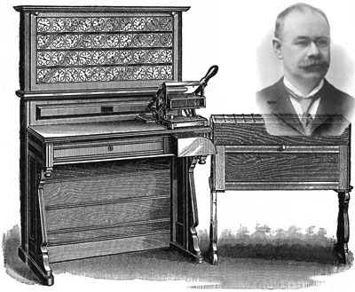

# Lesson 00

## Contents
- [Brief history of computing](#Short-History-of-Coding)
- [Basic coding logic example](#Basic-Coding-Logic-Example)
- [Programs to install/be aware of](#Things-to-Install-or-Be-Aware-of)

---

## Short History of Coding
In the 1600's, the term 'computer' referred to a person who completed calculations. When machines were built to complete basic calculations, they were called computing machines. Of course, eventually we stopped calling them machines, but the basic concept has stayed the same. With the right amount of time and knowledge, a human can do the same thing that a computer could do. In fact, early computers were not much faster than humans. In these days, the only real differences between a human doing work on pen and paper and a computer is *speed* and *accuracy*. In general, it is my opinion that if there is anything that I need to do that makes me role my eyes, a computer could do it faster and I can feel powerful and take responsibility for its achievements.


*Some lady who might be what a computer looked like, but she's probably way dead now*


Charles Babbage is credited to have designed the first significant computing machine. In 1830s-era war, artillery machines would be so sensitive to slight angles that a fraction of a degree or a mild draft could make you miss a target by a big margin. Huge logs were kept to outline what angle and direction should be used for a given set of conditions, but one small change in the artillery design meant they had to start over from scratch and make a new log, experimentally determining what angle would be best under loads of different conditions. This sucks. Charles Babbage devised a machine that would function for "general purposes", could store a bit of information, and even had a primitive printer. But yeah, that didn't end up going through, and he abandoned the idea for a simpler one. People built it later based off of his plans though, and it totally worked.


*Here's Babbage's machine. Also doubles as an egg slicer.*


If Babbage was the world's first computer engineer, Ada Lovelace (a mathematician) was the world's first computer programmer. She devised a set of instructions that could be given to Babbage's machine that could instruct it on computing numbers. This is seriously good stuff, cuz people had been giving instructions ever since growing babies and idiots appeared, but never had there been a bigger idiot in the world than this machine. No amount of saying "do you get it?" helped Lovelace explain her thoughts. She had to explain them with a huge amount of precision. What she did was invent an algorithm. Again, not the first to do that, but the first to do it for a machine computer.


*Ada Lovelace stored most of her intelligence in her excessively large side-buns*

Early electrical computers were literally hard-wired. Programming a machine that added numbers would literally be something akin to this example (though it may be totally different, I'm BSing things here):
```


       receive two numbers


               ↓


 take the first place digit of each 

     and send it to a logic gate


               ↓ 

LOGIC GATE:

   Compare the number to 10.

-----------------------------------

    (<10)      |       (≥10)  

-----------------------------------

set this to be |  add 1 to ten's

first place of |  place calculation

answer & go on |     & go on


```
If you wanted to do a different calculation or algorithm, you'd have to literally connect wires in a different way.

Later, the US census started to be a real pain. The 1880 census took freaking seven years to finish calculating after collecting the data, and that wasn't worth crap by the time it was done. The problem was that so many babies were being made by these horny Americans that calculating by hand was no good. So the US asked Herman Hollerith to figure something out. He introduced a punch-card system that provided a clear way to give a machine information and have it return something as well. These punch cards were used for a hecking long time as a way to communicate with computers (input/output). This cut calculations for the 1890 census down to 2.5 years. And this dude went on to make a "machine tabulating" company, which later became freaking IBM.


*Herman boi with his herman toi*

IBM itself a long time later (1944) made a huge room-size computer called the "Harvard Mark I". It included 500 miles of wire. It could only do one division problem every 15 seconds, which is worse in calculation speed than most anti-vaxxers, so it was really bad.


*The Harvard Mark I computer*

Obviously, with better hardware things got better, blah blah blah. Now I'm able to do stuff like wirelessly watch & not understand youtube videos of someone explaining the Higgs Boson at 2 in the morning.

---

## Basic Coding Logic Example
Imagine you meet someone who can follow instructions but can't reason for themself. Call them Ted. How would you explain to Ted how to figure out someone's name? You could just say "Figure out their name", but Ted is an idiot despite the fact that he totally put his pants on all by himself without needing any help. You'd have to be very specific. Your instructions might be this:


1. Say the words "What is your name?"

2. Wait until they speak and then stop speaking.

3. Whatever they said, write that down. Within yourself, refer to what you wrote down as 'name'.

4. Say the words "Nice to meet you" and then say 'name'.

5. Promptly walk away, and do not tell them about how you put your pants on all by yourself.


It's tedious to work with Ted, but you know exactly how it will go, assuming your instructions were clear enough for him.

---

## Things to Install or Be Aware of

### Introduction to the Terminal

Using the terminal was the OG way of communicating to your computer. It is both more powerful and less intuitive, which makes it doubly intimidating for beginners, but you'll do great after some practice. Follow the instructions below to get your terminal open (this will also help you get ready to use Github, which we'll discuss later):


> **Windows**
>
>There are two ways to handle this. Windows comes with PowerShell (or Command), but it is notoriously difficult to use. It is preferable to install a new terminal first, for your own sake. Click on [this link](https://git-scm.com/download) to install something called 'git' for Windows. This will also install another program that will be useful later.
>
> When you install, there will be lots of options it gives you, but it is best to just go with whatever is pre-selected and continue onward til it installs.
>
>Once installed, hit the Windows button on your keyboard and type "git bash". The newly-installed program will appear on the screen. Read on below to see how to handle this.

> **Mac**
>
> The terminal that comes with Mac is pretty darn good. To open it, you can hit Command + Space and type "terminal", and hit enter once it appears.
>
> To get access to some important tools, you may need to install the Developer Tools. To do this, type "git status" and hit enter in your terminal. If it prompts you to install the developer tools, do so. Once it is complete, close the terminal, open it again and type "git status" again. It should read `fatal: not a git repository (or any of the parent directories): .git` if it was successful.

Download Python
First things first, check if you already have python. If you're on Windows, hit the windows button and type "PowerShell", then hit enter. If you're on a Mac, go to your applications folder and open the "terminal" app.

Once that opens, type python -V (that's a capital V) and press enter. If it gives you an error, then we'll get python installed. If it works and is above version 3.2ish, then you're fine.

If you don't have python or a version more recent than python 3.2, go to Python's website and download whatever version of python it suggests (probably 3.8.2).

If you're on Mac, just go with the defaults and you're good.

If you're on Windows, the dialogue box at the very beginning will have a checkbox that says Add python to PATH. Make sure that is selected before going onwards.

Check the terminal again and see if python -V tells you the version number of what you just downloaded. If it doesn't, try python3 -V. If none of that works, lemme know and I'll help you out.


Make a New .py Document
Terminal method (fast, but you might not understand it)

Windows: On your desktop, hold shift and right click to open PowerShell. In PowerShell, type New-Item filename.py. It will be saved on your desktop.

Mac: In Finder, find a folder you want the doc in and right click, then clic "New Terminal at Folder". In the terminal, type touch filename.py.

Desktop method (multi-step but you'll get it)

Windows: Open Notepad. Do "Save as..." for the blank document. Change "File type" from "Text Document (.txt)" to "All Types". Name the document whatever you want, making sure that it ends in ".py". When you look where it was saved, it will be a python file.

Mac: Open TextEdit. Go to "Format" → "Make Plain Text". Save the blank document, naming it whatever you want, making sure that it ends in ".py". When you look where it was saved, it will be a python file.


Built-In Python Editor
When you downloaded Python, something called an IDE came with it. This is just a program that makes editing the python files easier. Right click on your new python file and click "Open With IDLE".

Basic Functions & Features
To test these functions, we're going to use a fast, interactive version of python. Go to your terminal/PowerShell and type python and hit enter.

We'll do some input/output examples. Note: Each function has something you give it and something it returns.

The print() function:

This function will take whatever words in quotes you give it and put it to the screen. The code print("Hello World") puts Hello World on your screen when you run it.

This is the most basic way of communicating to a user. Its 'input' (or argument) is just words in quotes, and its output (return type) is nothing, as it actually just performs an action.

The input() function:

This function will give the user a chance to type something. If you write input() in a program, the user will get a cursor, where they can type something and then press enter.

This function is even easier than I let on, because if you want to give the user instructions, you put them in quotes inside the function and it will automatically print that for you. Therefore, its argument is words in quotes, and it actually returns the words that the user responds with.

Example: running input("Why are you dead inside? ") will give the user a screen asking that question. If they type Coronavirus, then the input function actually returns Coronavirus.

The = operator (assignment):

If a function returns something, you can imagine that we'd like to store that information somewhere. The = sign gives us a way to put information in a variable, where it can be later accessed.

If we run variable_example = input() and the user types ur mom gay, then variable_example now has a value of ur mom gay.

It's more helpful to think of = as a way to store something than an equals sign. "Equals" in math doesn't care which side is which, but with the assignment operator, variable goes on the left, and the thing to store goes on the right.

Other things:

+ works just like normal for numbers, as does -, /, and *.

If you want to find the remainder of dividing two numbers, use % (called modulo arithmetic).

Both single-quotes and double-quotes work essentially the same, just don't mix and match.


.py File Example
Open up the file you made earlier with the IDLE. Something like this will work great for the example we talked about above:

name = input("What is your name? ")

print("Nice to meet you", name)

Note that in this example, the print function takes two arguments, separated by a comma. Since "Nice to meet you" and name are both words with quotes ( name is a variable for words with quotes, the return value of the input function), then this works just fine.

I can put that in my file and save (not save as). If the file is named ted.py, then in my terminal/PowerShell, I can type python ted.py and the program will run.


Data Types
You can imagine that you have to be really specific with computers. If you're trying to talk about the character "1", that would be different than the number 1. Computers use a few different ways to differentiate data:

Strings: These are what I have been calling "words in quotes". If any characters are between a set of quotes, it is considered words and is stored as words.

Floats: These are decimal numbers.

Integers: duh.

Booleans: These are things that either have the value True or False.

There are others, but these are the basic ones that matter.