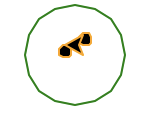

# Lesson 03

## Contents
- [Review & questions](#review-and-questions)
- [Modules](#modules)
- [The turtle module](#the-turtle-module)
- [To do before next time](#to-do-before-next-time)

---

## Review and Questions

- Data types we've learned so far: integer (`int`), strings (`str`), floats (`float`), boolean (`bool`).

    - Strings are inherently more complex than the other listed types, and there are many helpful methods to work with them.
    
    - Booleans can be created by comparing two numbers with any one of the following: `==`, `>=`, `<=`, `>`, `<`, and `!=`.

    - Numbers can be handled using basic binary operators (aka use only two inputs): `*`, `-`, `+`, `/`, `**`, `%`, `//`. Many people aren't familiar with `%` and `//`. The first is **modular arithmatic**, and effectively returns the remainder if dividing by a number (ex. `5 % 2` gives `1`, `13 % 7` gives `6`, `1 % 5` gives `1`, etc). The second is **integer division**, which gives the rounded-down result of division (ex. `5 // 2` gives `2`, `1 // 2` gives `0`, `13 // 2` gives `6`, etc). Both are very helpful in practice and can save a lot of tears.

    - All of these data types are **immutable**, meaning that any operations on them don't just change the value of the original, it creates a whole new one.

- Functions have inputs and outputs.

- The assignment operator (`=`) is used to store a value (integer, string, float, boolean, or even a function) into a variable.

    - This means that if `count = 1`, then after `count = count + 3`, `count` will have a value of `4`. It's not that `=` constitutes a mathematical equals sign: it takes the value of what is on the right and stores it in the variable on the right, erasing whatever was there before.
    - **Augmented operators** are operators that combine assignment with a binary operator. For example, the line `count = count + 3` can be *identically* written as `count += 3`. Obviously, the second is preferable because it's shorter and easier to see what is happening.

- `if`/`elif`/`else` statements are ways to run code conditionally. Similarly, `while` loops are similar to a stand-alone `if` statement except they repeat themselves until the condition is false.

    - There's always the chance to run into an infinite loop problem. For example, the code below will run indefinitely since the `while` loop content never allows `count` to decrease. This is an example of a logical error.

    ```python
    count = 1
    while count > 0:
        count += 1
    ```
    
    - Indentation matters a lot for these things! Code indented immediately below `if`/`while` is run, otherwise it is not. Also, you can nest one within another an indefinite number of times.

- There's actual code mistakes, and there's convention. The latter is essential, but only in the context of sharing your code. Be nice to yourself and others by making your code easy-to-read!


- The repl is a 'live' version of python that is really good for testing things when you are unsure about how something operates.

    - The built-in python documentation of a function, data type or module can be accessed using the `help()` function in the repl.

- An IDE (like VSCode) is a fancy text editior that can pre-validate your code before runtime and can suggest good convention. Further down the line, we'll learn how it can be used for debugging as well.

## Modules

There are many cases in coding where you could technically make some functionality from scratch, but someone has already done it, so you can & should lean on their work. When you refer to other documents (aka files) of code from your own code, the "imported" code document is called a **module**. Modules give you new functions and methods that allow you to do more things. To bring in modules to your program (whether they come with python or come downloaded from the internet), you'll type the following at the beginning of your program:

```python
import module_name
```

Of course, you'll put the actual module name. Now, if you want to refer to a function within that module somewhere in your code, you'll have to say something like this:

```python
module_name.function_name()
```

If you want to import the module's functions and make it so you don't have to type the module name every time you refer to those functions, type

```python
from module_name import function1, function2
```

Now, you can to refer to those functions from the module just by their names. You can think of the difference between the two like this: Just importing it basically gives your program access to the module with the caveat that you have to tell the program where to look every time you're talking about things from it. However, saying `from module_name import function` basically dumps that function of the module straight into your program, so your program never has to look at the module again. There's reasons to do one or the other, but for now, who cares.

*Side Note:* Additional to functions and methods, modules often introduce new **objects**. The term object here refers to a data type, except more complex than strings, integers, floats and booleans. Those data types are so rudimentary that they're called **primitive data types**. "Object" usually refers to other data types that are more complex, some examples we'll see below.

A great example is trigonometry. The functions *sine* and *cosine* are in the `math` module, so here is a short example of how you would use that:

```python
import math
print(math.sin(2))
```

Using the other method, we can also do

```python
from math import sin
print(sin(2))
```

Some modules have to be installed from the internet, but there are a ton that come with python. Take a look at the list of modules you have by typing `help("modules")` in the repl.

## The Turtle Module

This module is very basic, but it can really help you get a feel of what coding can be like. The `turtle` module is meant to provide an easy way to draw shapes on the screen. It's definitely not professional-grade stuff, but it's good for practice and learning.

The concept here is that you have a turtle that draws as it travels. It can do straight lines and circles, in all sorts of colors. If it completes the tracing of a shape, it can fill in the shape with any shade of color. Let's try to write a program that is able to draw a smiley face. 

We'll start by making a new .py file for it (either using the IDE or by using `touch` in the command line). Let's import the module into the program:

```python
import turtle
```

Very crazy stuff so far. Let me introduce you to a few things in this module to get started:

1. `turtle.showturtle()`: We want the turtle to show up on the screen so it can start drawing. This is what kinda starts the drawing.
2. `turtle.setheading(to_angle)`: This points the turtle in the direction you want to start drawing. `to_angle` is in degrees. According to the documentation, `0` is east, `90` is north, and so forth.
3. `turtle.penup()`: Maybe you can guess, but this one is where you want to move the turtle but not draw while it's being moved. Once you want it to start drawing, use `turtle.pendown()`.
4. `turtle.goto(x,y)`: This moves the turtle to an `x` and `y` pixel position. This is not relative, meaning that it's not like the turtle moves `x` units left and `y` units up, it's more like it goes to the pixel at `x` and `y`.
5. `turtle.color(colorstring)`: Put in a color as a string, like `"red"`, to set the color the turtle draws. If you want it to fill in a shape, then you can use `turtle.fillcolor(colorstring)` to fill whatever you drew. Just make sure that you use `turtle.begin_fill()` and `turtle.end_fill()` to tell the program which paths you want to fill.
6. `turtle.forward(distance)`: This one is nicely simple. Wherever you're pointed, you go forward `distance` pixels.
7. `turtle.left(angle)` and `turtle.right(angle)`: It just turns the turtle by `angle` degrees. Pretty fancy.
8. `turtle.circle(radius, extent=None, steps=None)`: You can draw circles & arcs with this. Wherever the turtle is, it pretends the circle's center is `radius` pixels to the left of it, and starts drawing a circle from there. If you only want to draw a fraction of a circle (like a semicircle or an arc), then you can put in `extent` degrees. The `steps` argument is just about how many straight lines it will use to draw the circle, but you can ignore this.
9. `turtle.hideturtle()` and `turtle.done()`: used to end your program.

Let's go ahead and try a few practice programs. Here's the bare-bones of any turtle project will look like:

```python
import turtle

turtle.showturtle()
turtle.setheading(someangle). # of course put an actual angle here.

# stuff goes here.

turtle.hideturtle()
turtle.done()
```

From here on out, as I add to the program template above, I'll put comments at the ends of the lines that have had changes.

If we want to draw a circle in green (with no fill), we could do this program:

```python
import turtle

turtle.showturtle()
turtle.setheading(0) # added the zero

turtle.color("green") # new
turtle.circle(25) # new

turtle.hideturtle()
turtle.done()
```

That gives us the following picture, right before the turtle is hidden. Wow so pretty! The arrow is a turtle.

<p style="text-align:center;">

</p>

Now, let's try to give it black eyes with orange outlines. Since the circle has a radius of 25, then we could get just past the middle by turning left 90 degrees and going forward 30 pixels:

```python
import turtle

turtle.showturtle()
turtle.setheading(0)

turtle.color("green")
turtle.circle(25)

turtle.left(90) # new
turtle.forward(30) # new

turtle.hideturtle()
turtle.done()
```

Below is what we get before hiding the turtle. Oh whoops, I didn't lift up the pen. What an embarrassing, completely unintentional mistake. Let's fix that.

<p style="text-align:center;">

</p>

```python
import turtle

turtle.showturtle()
turtle.setheading(0)

turtle.color("green")
turtle.circle(25)

turtle.penup() # new
turtle.left(90)
turtle.forward(30)
turtle.pendown() #new

turtle.hideturtle()
turtle.done()
```

This is what we get (right before we hide the turtle again). Much better. We'll go ahead and move on to make two eyes.

<p style="text-align:center;">

</p>

```python
import turtle

turtle.showturtle()
turtle.setheading(0)

turtle.color("green")
turtle.circle(25)

turtle.penup()
turtle.left(90)
turtle.forward(30)
turtle.right(90) # new
turtle.forward(5) # new
turtle.pendown()

turtle.color("orange") # new
turtle.fillcolor("black") # new
turtle.begin_fill() # new
turtle.circle(3) # new
turtle.end_fill() # new

turtle.hideturtle()
turtle.done()
```

Looks like we got the right eye, again before hiding the turtle. Let's try for the left by going the same distance on the other side of the face. We'll remember to lift the pen up for this one.

<p style="text-align:center;">

</p>

```python
import turtle

turtle.showturtle()
turtle.setheading(0)

turtle.color("green")
turtle.circle(25)

turtle.penup()
turtle.left(90)
turtle.forward(30)
turtle.right(90)
turtle.forward(5)
turtle.pendown()

turtle.color("orange")
turtle.fillcolor("black")
turtle.begin_fill()
turtle.circle(3)
turtle.end_fill()

turtle.penup() # new 
turtle.right(180) # new
turtle.forward(10) # new
turtle.pendown() # new
turtle.begin_fill() # new
turtle.circle(3) # new
turtle.end_fill() # new

turtle.hideturtle()
turtle.done()
```

That left eye isn't doing so hot. Why is that? Well, the turtle was pointing west when it started drawing the circle. It always draws circles to its left. If that's the case, I can just flip the turtle to face east at the same point by adding `turtle.right(180)` just before the `turtle.pendown()` command.


 | 
:-:|:-:
before hiding turtle | wow the turtle is no here

Anyways. We could keep going with this, but I'm going to add a few things, and leave comments so you can follow along. If you use a number multiple times, it would be good to just throw it into a variable so you can adjust it later. Check out `eye_dist` and `head_radius` for examples of this.

```python
import turtle

eye_dist = 15  # a little wider than before
head_radius = 25

turtle.showturtle()
turtle.setheading(0)

# head
turtle.color("green")
turtle.circle(head_radius)

# right eye
turtle.penup()
turtle.left(90)
turtle.forward(head_radius * 6 / 5)  # a little more than half way up the head

turtle.right(90)
turtle.forward(eye_dist / 2)  # from middle of face
turtle.pendown()
turtle.color("orange")
turtle.fillcolor("black")
turtle.begin_fill()
turtle.circle(head_radius / 6)  # this means the eyes are always proportional to the head
turtle.end_fill()

# left eye
turtle.penup()
turtle.right(180)
turtle.forward(eye_dist)  # since it's from right to left, it's the whole distance
turtle.right(180)
turtle.pendown()
turtle.begin_fill()
turtle.circle(head_radius / 6)
turtle.end_fill()

# smirky smile
turtle.penup()
turtle.forward(eye_dist / 2)
turtle.right(90)
turtle.forward(head_radius * 4 / 5)
turtle.right(120)  # a little more than right angle to get to the corner of the smile

turtle.forward(head_radius / 2)
turtle.right(180)
turtle.color("blue")
turtle.pendown()
turtle.circle(head_radius * 11 / 10, 40)  
# makes a smile with a bit bigger radius than head, 
# and only 40 degrees of it.

turtle.hideturtle()
turtle.done()
```

<figure style="text-align:center;">
    
    <figcaption>Creepy af, but it is done.</figcaption>
</figure>


## To Do Before Next Time

> *To Do*: Complete the following project before next meeting and turn it in on Canvas.

### Project: Create a program that will ask the user to pick a color and picture to make, and then it is drawn.
Ask the user to pick from three colors. Then, ask them to pick between two pictures (ex: snowman, pyramid of giza, something simple in shape). Then have the turtle go draw the picture chosen with the selected color as its background. Here are some tips for you:

- Something like this can work well for the menu. It does look a little messy, but try it out to see what it looks like, then look back and see what's going on. Talk out a few scenarios with yourself to see if you understand it. Also, notice the use of `\n` characters.
    ```python
    valid_answer = False # read as: "the user has not yet given a valid answer"
    color = "" # no color has been chosen yet

    while not valid_answer:  # aka while there is no valid answer from the user yet
        choice1 = input("Pick one of the following colors by entering its associated numbers:\n1)red\n2)blue\n3)green\nType your answer here: ") 

        if choice1 == "1":
            color = "red"
            valid_answer = True # read as: "now the user has given a valid answer"
        elif choice1 == "2":
            color = "blue"
            valid_answer = True # read as: "now the user has given a valid answer"
        elif choice1 == "3"
            color = "green"
            valid_answer = True # read as: "now the user has given a valid answer"
        else:
            print("Your input was invalid. Try again.")
    ```
In the code above, you could then use the variable color to fill the shape wherever you need it. However, picking between the two shapes will require an `if` and `elif` that contain the whole instructions to draw the picture.
