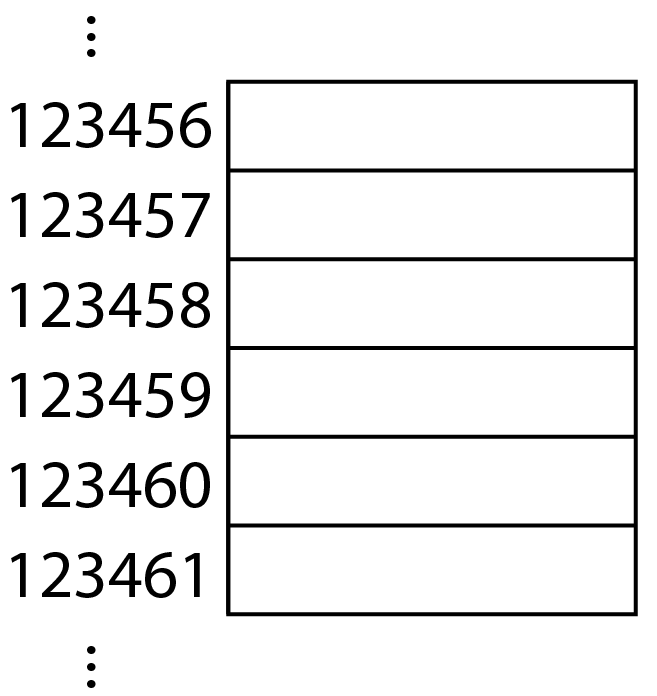
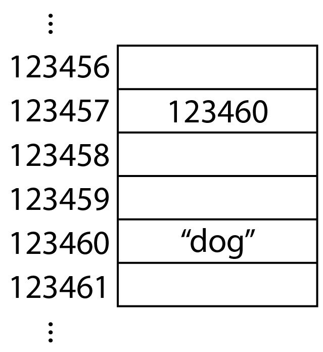
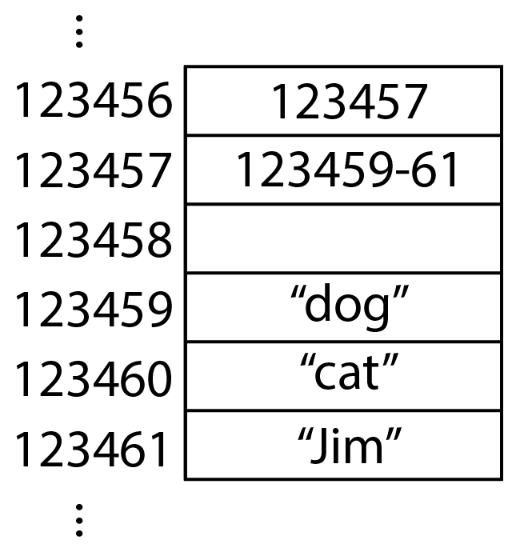

# Lesson 05

## Contents
- [Review](#review)
- [More on Immutability](#more-on-immutability)
- [Lists](#lists)
- [Sorting](#sorting)
- [To do before next time](#to-do-before-next-time)

---

## Review

- `for` loops repeat code for each item in an iterable. `while` loops repeat code as long as the given condition evaluates to `true`.

- Files are open in python with the `open` function, and then can be read with the `.read()` method, and *should* be closed with the `.close()` method to make sure your computer can focus on more important things. Check out the [practice python file](access_files.py) to see more features of this file usage in python.

## More on Immutability

There's something different with lists that we haven't seen before. To start, let's talk briefly about how variables and data work. 

Variables point to where the data is stored on your computer. I'll get the details of this way off on this for sure, so don't go away thinking this is how it do be 100%, but the picture below is the general idea of what your storage looks like. If this is not correct, then it is a good way to think about things anyways. There's a huge list of slots to put things into, so your program will be storing things in these memory slots.



Let's start by saying `word = "dog"` in a program. That line does this: it makes the string `"dog"` and might store it at `123460`. Then, it makes the variable `word` and might store it at `123457` in memory. That means that whenever in the program we say the variable, the program knows to look at `123457`. Then, at the location where `word` stores things, the address for `"dog"` is stored. Overall, your memory now looks like this:



Now, whenever you call for `word` in your program, the computer checks what's at `123457`, then sees the `123460` and goes there, and then gets the word `"dog"`. Note that the whole word `"dog"` is stored all together, not character by character. Strings have a special property called **immutability**, meaning you can't change the string itself, you can only make new strings.

We've learned about `bool`s, `str`s, `int`s and `float`s. All are *immutable*, meaning that they cannot change. See the example below:

```python
value = 5
print(id(value))

# Above, it tells us the memory address of the number stored in `value`.
# If we run the code again, we get the same output:

print(id(value))

# Now, what happens when we add 1 to `value`? Is it the same integer
# object, just changed in value, or is it a brand new integer?

value += 1
print(id(value))
```
You'll see that the integer stored in `value` is actually swapped out for a *new* integer. Now that might not seem all that interesting, but it becomes interesting when you make *copies* of things. Check out the exercise below and guess what the two things printed out will be, and see if it meets you expectations:

```python
string1 = "So here's the story from A to Z. "
string2 = string1 
# Above is where the "copy" is made
string2 += "You wanna get with me? You gotta listen carefully"
# Add stuff to the end of the copy

# What prints out?
print(string1)
print(string2)
```

When you try this, you'll see that they are distinct strings when printed out. This is further illuminated by this code below (it will make the most sense after running it):

```python
string1 = "So here's the story from A to Z. "
string2 = string1 

print("-"*16)
print("Original Copies:")
print("-"*16)

print("string1's id (location in memory) is", id(string1))
print("string2's id (location in memory) is", id(string2))

string2 += "You wanna get with me? You gotta listen carefully"

print("\n" + "-"*28)
print("After Addition onto string2:")
print("-"*28)
print("string1 is located at", id(string1), "and has this value:", string1)
print("string2 is located at", id(string2), "and has this value:", string2)
```

A few things here:
- The `id` of `string1` doesn't change after the addition of characters. Initially, `string1` and `string2` have the same `id` but after the addition, `string2`'s `id` changes. This is because a *new* string was made. Likewise, in the code below, using a method (in this case, `.upper()`) on a string does not change the original string but instead returns a new string.
    ```python
    string_ex = "hello"
    print("Before .upper():", id(string_ex))
    string_ex.upper()
    print("After .upper():", id(string_ex))
    print("What is returned by .upper():", id(string_ex.upper()))
    ```
- This shows that strings are immutable. That is usually the case for coding languages with integers, strings, floats and booleans (often called "primitive data types"). However, it is not always the case that all data types are immutable.
- *Note*: if you run either of the two above code blocks multiple times, you'll see that you'll get different `id` results between runs. That's because python is making a fresh string from what you typed out each time.

## Lists

A turning point in your python career swiftly approaches. Soon, the power of the world will be at your very fingertips.

In most cases for any interesting coding problem, you'll want to somewhere in your code use a collection of things. For example, you may have numbers for some measurement you've been making, and you want to square each of them. Or something like that. Well, that would look like this:

```python
lst = [1, 5, 6, 2, 3, 4, 1]

for entry in lst:
    print(entry**2)
```

Or, alternatively:

```python
lst = [1, 5, 6, 2, 3, 4, 1]

for i in range(len(lst)):
    print(lst[i]**2)
```

Note that both above use `for` loops, but the first uses the list itself as the iterable for the `for` loop whereas the second instead uses a `range` object that goes from `0` up til (but not including) `7`, and then the respective element is accessed much like it would be in a string: by using `[]`.

*Side comment:* It's a bad idea to name a variable `list` since that's also the name of the function to convert things to lists. That's why I have `lst` as the variable name above.

Lists do not have to be of all the same data type. The list below is valid in python. However, it is not always a great idea to use this feature since it is considered sloppy design.

```python
lst = [0, "One", 2.0, "3"]
```

As you'll see below, lists have some characteristics that they share with strings, but certainly not all.

Here are a few things to know about using lists:
- `len()` is the function to find the number of items in the list (same as strings in finding number of characters).
- `[]` can be used to get the element at a given index (same as strings in getting character at given index). Ranges can also be given, such as `lst[3:6]`, which returns a list of the elements from index 3 up to but not including index 6 (also like strings).
- `.index()` is a method that can find the first occurence of a given object (also like strings).
- `in` can be used to test if an element is in a list to return a boolean (like strings).

Changing to things that lists can do that strings can't:
- `.pop()` **removes** & **returns** the last element (if empty parentheses) or specified element (if index given) of list. See below:
    ```python
    lst = [1, 3, 5, 7]

    print("lst before .pop():", lst)

    output = lst.pop()

    print("output of .pop():", output)
    print("lst after .pop():", lst)
    ```
- Reexamining the code from above, we can also see that although `lst` is only assigned something *once*, that thing **changes** after getting `.pop()` called on it. Let's see if the computer also considers it the same thing:
    ```python
    lst = [1, 3, 5, 7]

    print("lst before .pop():", lst)
    print("lst id before .pop():", id(lst))

    print("id of last element before .pop()", id(lst[3]))

    output = lst.pop()

    print("output of .pop():", output)
    print("id of output of .pop():", id(output))

    print("lst after .pop():", lst)
    print("lst id after .pop():", id(lst))
    ```
    This demonstrates that lists are **mutable** in python, unlike strings.
- You can change individual elements of lists without having to make a whole new list using `[]` and `=` together, which you can't do with strings:
    ```python
    lst = [1,6,3,4,5]
    lst[1] = 2
    print(lst)
    ```
- You can add to the end of lists without needing to make a new list:
    ```python
    lst = [1,2,3,4,5]
    lst.append(6) # add single element
    lst += [7,8,9] # add multiple elements
    print(lst)
    ```

Now, let's go back to talking about memory and look at how lists do things differently.

Say we run the line `myList = ["dog","cat","Jim"]`. Then, what happens is a little more complicated. First, the three strings find a home in memory somewhere and stay there (below, they are in `123459`-`123461`). Then, a list is made that holds the addresses to each of those strings, and this list is stored somewhere, like at address `123457`. Finally, the variable `myList` is created at `123456`, and the reference to the location of the list is stored there. Hopefully the illustration below makes sense:



Mutability is really nice for lists. It's nice to have just one list that you can add things to, instead of having to make new ones all the time like with strings. This comes at a small cost, though. Run the code below and see what happens:

```python
guestList1 = ["Sam","Pam","Gamgee"]
guestList2 = guestList1  # attempt to make a copy

guestList2[1] = "Davy"
print(guestList1)
print(guestList2)
```
You can see here that any change you make to `guestList2` will also occur in `guestList1`, and this is due to the fact that you're not making a *copy* of the list in line 2, you're actually just straight up telling both variables to point to the same thing. To fix this, use the `.copy()` method in line 2 instead, which will make a new spot in memory for a copied list:

```python
guestList2 = guestList1.copy()
```

One last tidbit, if you want to swap the position of two elements in a list in python, you can do one of the following:

```python
lst = [1, 2, 3]
# GOAL: switch the 1 and the 2 in lst

# BAD method. Think: why would this NOT work?
lst[1] = lst[0]
lst[0] = lst[1]

# Good Method 1: use temp variable.
temp = lst[1]
lst[1] = lst[0]
lst[0] = temp

# Good Method 2: simultaneous assignment.
lst[0], lst[1] = lst[1], lst[0]

# The last thing is just a fancy python work-around. It can be used in other places too, just throwing this out there.

# ALSO, note that if lst[0] or lst[1] is on the left of the assignment operator (aka =), then it is treated like a variable holding a spot in the list. If it is on the right, it is simply returning what is stored in that position. Not really all that different from regular variables, but important to note when you're thinking of mutability.

```

## Sorting

If you talk to a real-life computer scientist, they are likely interested in the subfield of sorting. That sounds like the dumbest thing ever, but it's legit! Think about this list of numbers (not written in python, going for ideas here):

```
1, 5, 6, 2, 3, 1, 4
```
Now, and I'm not kidding when I ask this, how the heck do you sort this from low to high? In other words, what would you do step-by-step for the list above to get it in order? Turns out this **is** and interesting question lol.

> *To Do*: Try to devise a set of instructions (using English, not code) that would successfully 

Turns out there are literally hundreds of approaches, each with varying levels of effectiveness under case-specific contexts. It's good practice to see this code in practice even though you'll likely not get into this topic.

Additionally, this gets us an introduction to the idea of "algorithms", which blur the lines between computer science and mathematics in a really cool way. Don't worry, this math is approachable and puzzle-like instead of calculus math, which you may not be fond of.

### Bogo Sort

There does not exists a worse approach to sorting than [bogo sort](https://en.wikipedia.org/wiki/Bogosort). Imagine having 10 playing cards in your hand and shuffling them over and over again until it happens to be in the right order. And yes, that means that if you shuffle it and it's only one card off, you're not allowed to make the one fix, you have to reshuffle it and hope for the best next time.

Notice that this gives no guarantee for successful sorting in a reasonable amount of time, and the bigger the list gets the less effective this algorithm becomes. If the list has $n$ objects, then on average it takes $n!$ (aka $n$-factorial) tries to get it right. So that means a list of size 5 would on average take 120 tries to get sorted, which isn't too bad, but if you have 100 objects in the list, it is no exaggeration to say that humanity and the universe itself will no longer exist by the time this algorithm could sort that list at any currently feasible speeds.

This sorting algorithm was introduced as a joke. Noice.

### Bubble Sort

[Bubble sort](https://en.wikipedia.org/wiki/Bubble_sort) is a nice, approachable idea to sorting. It might even be similar to the one you thought of when you were thinking about this.

Small detail: this is reffered to as an in-place sorting algorithm, meaning that this algorithm changes the order of the numbers in the list instead of producing a new, sorted version of the original list.

**Pass 1:**

1. Start by looking at the first two numbers in the list (aka the numbers at index `0` and `1`). Which is bigger? If the left number is bigger than the right, switch their positions. Otherwise, leave them alone.
2. Now, look at whatever is at indices `1` and `2`. Which is bigger? Do the same as before.

    etc... etc...

At the end of Pass 1, nothing is guaranteed except one thing: the *biggest* number in the list will have "bubbled up" to the last position of the list. We don't know much, but by golly we know that the last number in the list is right where it is supposed to be.

Now what? Well, besides the last number, we're clueless about where the other numbers are supposed to go. Sounds like we're in the same situation we were before, if we ignore the last number. (I'm going to cringily fake realization here, forgive me) WAIT A MINUTE, what if we just repeated this "pass 1" process over and over, every time putting the next-highest number in its place until we're all in order? That'll work.

Note that once numbers are where they are supposed to be, we don't mess with them anymore and effectively ignore them for the rest of the algorithm.

This method, *unlike* Bogo sort and *like* most other sorts, guarantees that it will get sorted by a certain time. And that's nice. Anyway, I could get hecka complicated with this but I'm leaving it here, besides to show an example of bubble sort written in python:

```python
lst = [1, 5, 6, 2, 3, 1, 4]

for end_index in range(len(lst)-1, 1, -1):
    # This "end_index" is to help ignore the parts
    # that are already sorted as we progress.
    for i in range(end_index):
        if lst[i] > lst[i+1]:
            lst[i], lst[i+1] = lst[i+1], lst[i]
        # Only switches if the two are out of order.
        # Nothing happens otherwise.

print(lst)        
```

Also, python just packages sorting for us in a couple of functions, which is usually what you ought to do:

```python
lst = [1, 5, 6, 2, 3, 1, 4]
lst.sort() # in-place sorting: it will modify the list
sorted(lst) # out-of-place sorting: returns new, sorted list (no modification to original)
```

### Other sorts worth looking at

Like these are pretty funny (or at least interesting) videos to watch so maybe watch them for fun.

- [Insertion sort dance](https://www.youtube.com/watch?v=ROalU379l3U)
- [Quick sort dance](https://www.youtube.com/watch?v=ywWBy6J5gz8) (this is generally the preferred method of sorting, and it was kinda a breakthrough for computer scientists in reducing sorting speeds)
- [Selection sort animation](https://upload.wikimedia.org/wikipedia/commons/9/94/Selection-Sort-Animation.gif)
- [A video](https://www.youtube.com/watch?v=kPRA0W1kECg) showing several different sorting algorithms (look at top left for name of sorting)

## To Do Before Next Time

> *To Do*: Complete the following project before next meeting.

### Project: Check the spelling of words in a file based on a dictionary.

You have two files. One is a dictionary, basically, and another is a paper you wrote late at night while you were dozing off. How can you make a program that will check which words in your paper are in the dictionary and which ones aren't? Here's the [dictionary](dictionary.txt) and your [late-night paper](paper.txt). Use at least one function and one list.

